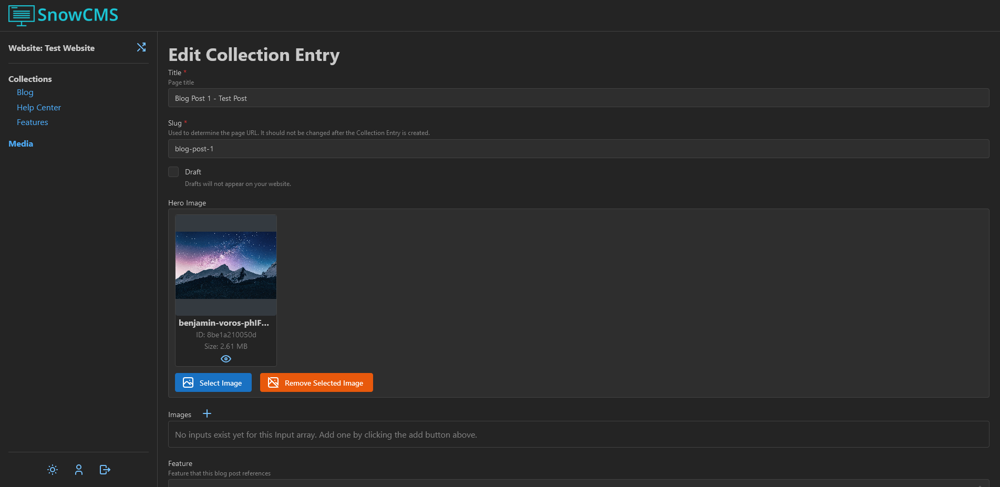

Collection Entries are entries of a Collection (e.g. blog posts).

The inputs on this page depend on the Collection settings. Contact the your website or CMS administrator for additional information.

## Drafts

When creating a new Collection Entry or editing an existing one, you can choose to save your changes as a draft.

Drafts are not visible on your website until they are published, making them ideal for staging new content or preparing updates for review.
- New drafts (not based on existing entries) create a new Collection Entry with a new creation date when published.
- Drafts based on existing entries will update that entry when published, keeping the original entry ID but updating its content.
