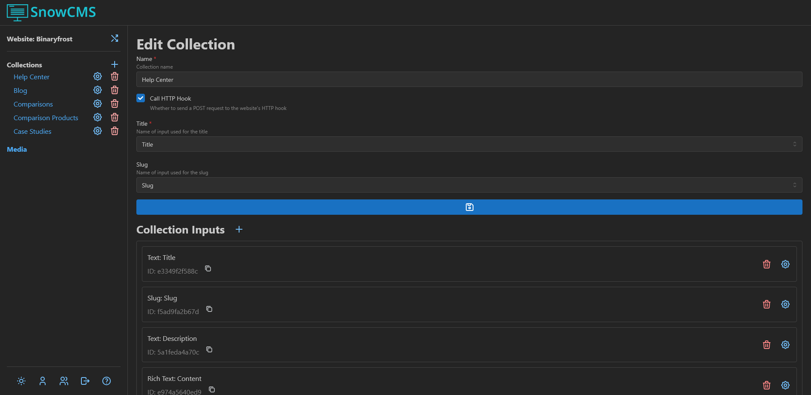

Collections are groups of structured data that you can edit through the CMS. You could have a `Blog` Collection for blog posts, a `Features` Collection for product features, etc.

## Collection Settings

:::note
The information in this section is only applicable to users with the `SUPERUSER` role or higher.
:::

In the Collection Settings, you can rename the Collection, set the Collection Input that will be used as the title in the Collection Entry list, set the Collection Input used as the slug, and manage Collection Inputs.

Before renaming or deleting Collection Inputs, you should ensure that the website code does not rely on the Collection Input existing.

