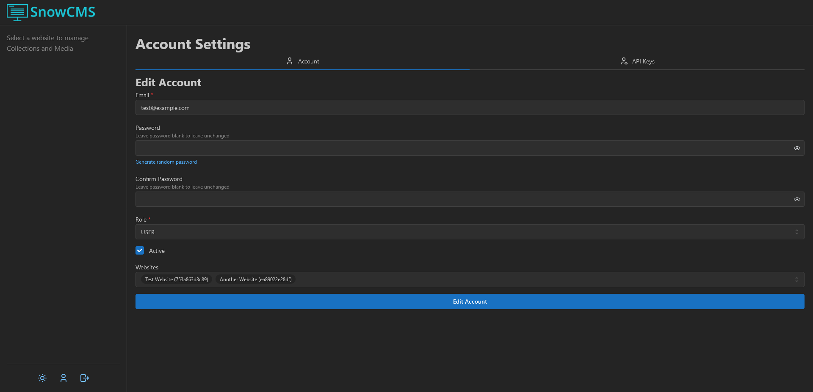
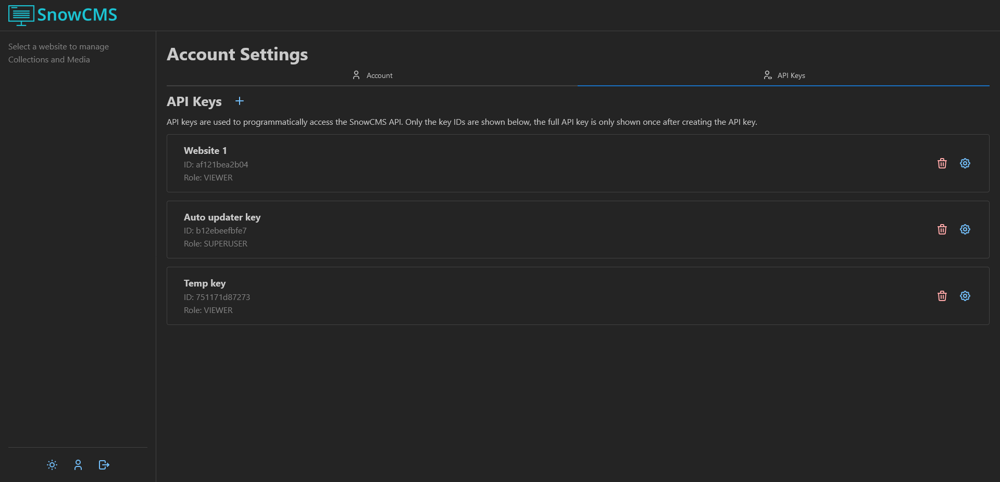
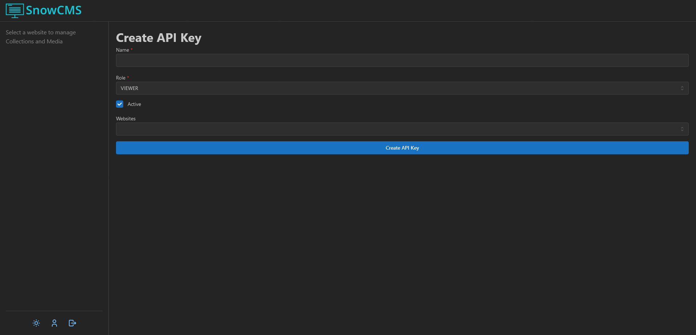

A link to your account settings can be found at the bottom of the sidebar.

Here you can change your email address or password, and create API keys.

While you can see your role and websites, only admins can change these.

## Roles

Higher roles inherit permissions from lower roles. For example, the `SUPERUSER` role has all the permissions from the `USER` role.

### Viewer

The `VIEWER` role is similar to the `USER` role, but cannot edit anything.

### User

Users with the `USER` role can add, edit, and remove Collection Entries and Media for all Collections in all websites that they have access to.

### Superuser

Users with the `SUPERUSER` role can add, edit, and remove Collections. They can also edit a website's name and deploy hook.

### Admin

Users with the `ADMIN` role can add, edit, and remove websites and users.

## API Keys

API keys are used for websites and other code to interact with SnowCMS.

:::caution
Be careful when deleting API keys. Any code using that API key will stop working.
:::

### Creating API Keys

You can create API keys to allow your website to fetch content from the CMS, or to write code that automates actions (such as creating a post at a specific time).

These API keys can be scoped to a specific website and set its role to your own role or lower.

Be sure to copy the API key after creating it. The full API key will only be shown once.

:::tip
For security purposes, it is recommended to use the lowest role that achieves your goal. For example, if you just need to access content but not change anything, then using the `VIEWER` role is recommended.
:::

### Using API Keys

See [API Routes](/user/api/).
