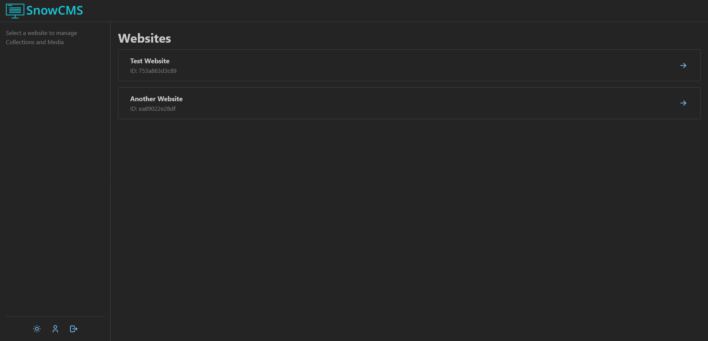

After logging in, you will see the list of websites you have access to.

If you have the `SUPERUSER` role, you can also access the website settings to edit its name and deploy hook.

:::caution
Don't change these settings unless you know what you're doing. Incorrectly configuring the deploy hook could result in your website no longer automatically updating.
:::
